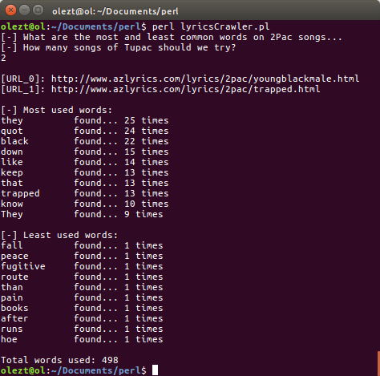

# Lyrics-Crawler
Most / Least used words on your favorite artist lyrics

**Author: olezt**

### Description

This is a crawl script written in Perl which analyze lyrics to identify the most and least common used words of an artist. Lyrics are obtained by www.azlyrics.com.  
For now it is available only for Tupac. But soon it will be dynamic so it can be used for any well known artist.

### How to use

1. Open cmd and execute perl lyricsCrawler.pl
2. Specify number of songs you want to analyze and wait for the results.

### Requirements

1. Perl 5

### Future Additions

1. User will specify artist
2. Sort least common words, by number of letters
3. Extract from common words, words with less than 2 letters

