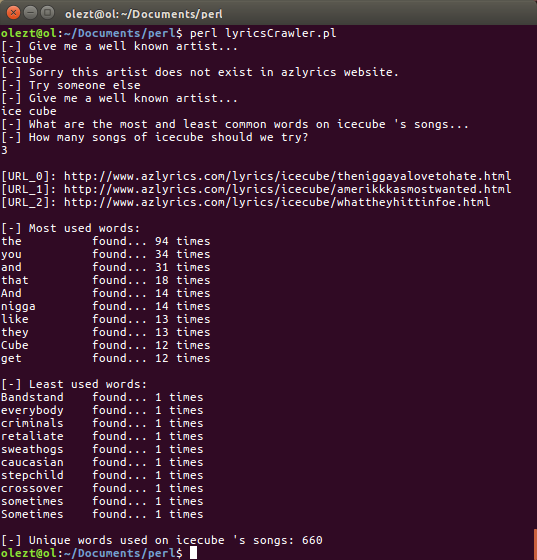

# Lyrics-Crawler
Most / Least common words of your favorite artists' lyrics

**Author: olezt**

### Description

Find out the most and least common words that your favorite -or not- artists use in their lyrics.<br>
Songs are used in random sequence each time.<br>

See below for possible cli Arguments.<br>

Written entirely in Perl.<br>

Lyrics are obtained by www.azlyrics.com. Only for educational purposes.<br>
Keep in mind that using great number for songs to analyze may cause a ban ip. If it happen,you can restart your router. :laughing:

### Cli Arguments:
Name   |   Description   |   Example
------------ | ------------- | -------------
-u 	  |  Set url of a specific song to analyze | -u http://www.azlyrics.com/lyrics/2pac/meagainsttheworld.html
-f   |  Set a file with songs' urls as input | -f songs.txt

### How to use

1. Open cmd and execute ```perl lyricsCrawler.pl```
2. Specify a well known artist - He/She must be available on www.azlyrics.com.
3. Specify number of songs you want to analyze and enjoy the results.



### Requirements

1. Perl 5.8.0
